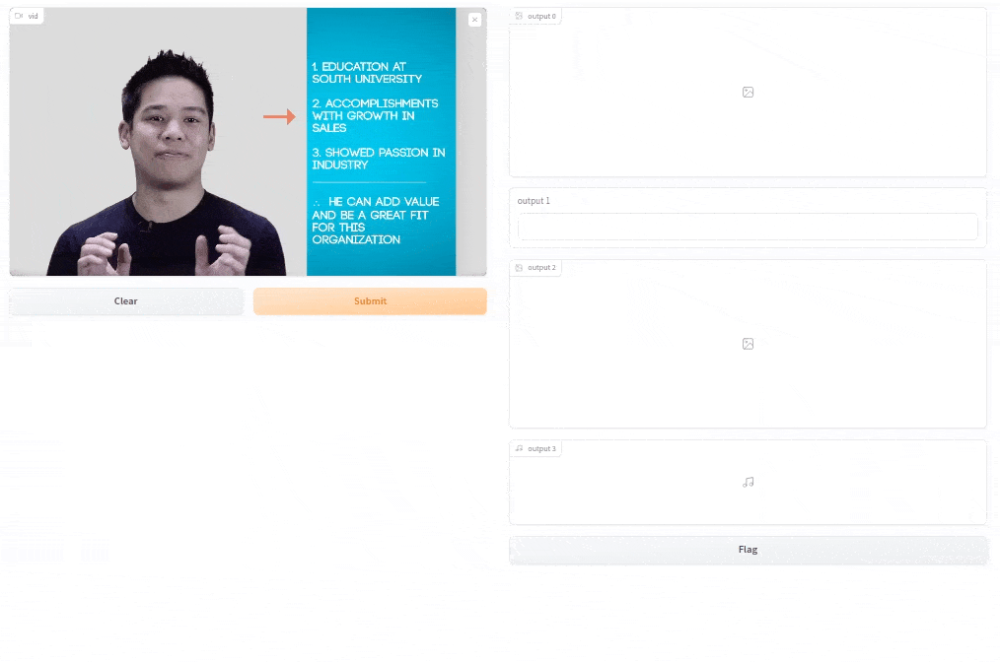

## Air-Text (Air-Writing System)
Air-Text is a novel system to write in the air using fingertips as a pen. Air-Text provides various functionalities by the seamless integration of Air-Writing and Text-Recognition Modules. Specifically, the Air-Writing Module takes a sequence of RGB images as input and tracks both the location of fingertips and current hand gesture class frame by frame. Users can easily perform writing operations such as writing or deleting a text by changing hand gestures, and tracked fingertip locations can be stored as a binary image. Then the Text-Recognition Module, which is compatible with any pre-trained recognition models, predicts a written single digit or English word in the binary image.

{:style="display:block; margin-left:auto; margin-right:auto"}

## Video Multimodal Emotion Recognition System
This is a system capable of recognizing a speaker's utterance-level emotion through multimodal cues in a video. The system integrates multiple AI models to first extract and pre-process multimodal information from the raw video input. Next, an end-to-end MER model sequentially predicts the speaker's emotions at the utterance level. Additionally, users can interactively demonstrate the system through the implemented interface.

{:style="display:block; margin-left:auto; margin-right:auto"}

 